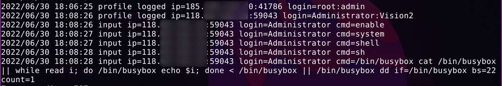
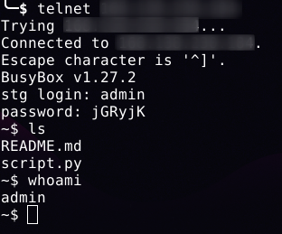

<h1 align="center">Faketelnet</h1>

faketelnet is a honeypot that simulates the operation of a common telnet service. The program is written in Golang for ease of use, as dependency management is not required. 

This project implements a dynamic telnet server trying to act as a honeypot for IoT malware or other types of botnets that spreads insecure default passwords on telnet servers over the Internet.

The software simulates an interactive shell environment and binds executed commands for future analysis.

Faketelnet has the ability to run commands executed with **BusyBox**, so a more realistic system environment can be simulated inside a container and so on.

Example of captured interaction:



Interacting with the service:



```bash
╰─$ go run faketelnet -h                      
#### faketelnet ####                          
                                              
COMMAND  DESCRIPTION          DEFAULT         
-------  -----------          -------         
-h       Help menu.           False           
-b       Specify banner.      BusyBox v1.27.2 
-a       Address Host:port.   0.0.0.0:5555    
-u       User for login.      none            
-p       Password for login.  none            
-busy    Set BusyBox path.    none            
```


## Download and Run

```bash
git clone https://github.com/farinap5/faketelnet.git
```

```bash
cd faketelnet
sudo go run faketelnet -a 0.0.0.0:23
```